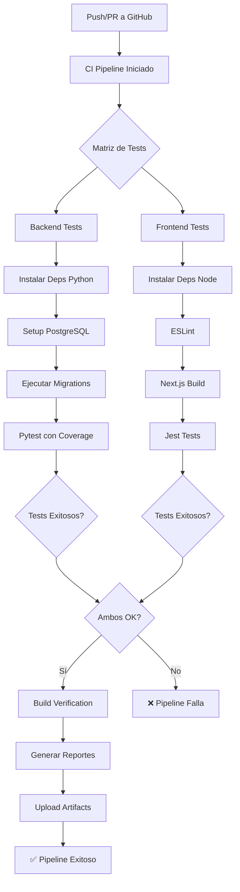

# 🚀 Sistema de Integración Continua (CI/CD)

## Descripción

Este proyecto incluye un pipeline de integración continua completo que automatiza:

- **Compilación** de código backend y frontend
- **Ejecución de pruebas** automatizadas
- **Análisis de calidad** (linting)
- **Generación de reportes** de cobertura
- **Verificación de builds** exitosos

## 📋 Componentes

### 1. **GitHub Actions Pipeline** (`.github/workflows/ci.yml`)

Ejecuta automáticamente en cada push o pull request a las ramas `main` y `develop`.

**Jobs:**
- `backend-tests`: Pruebas de Django con PostgreSQL
- `frontend-tests`: Validación y tests de Next.js
- `build-verification`: Verificación final de builds

**Características:**
- Base de datos PostgreSQL en contenedor para tests
- Cobertura de código (backend)
- Cache de dependencias para mayor velocidad
- Reportes de cobertura en Codecov

### 2. **Scripts de Build Locales**

#### Windows: `scripts/build.bat`
```batch
# Compilar todo
build.bat all

# Solo backend
build.bat backend

# Solo frontend
build.bat frontend
```

#### Linux/macOS: `scripts/build.sh`
```bash
# Compilar todo
./scripts/build.sh all

# Solo backend
./scripts/build.sh backend

# Solo frontend
./scripts/build.sh frontend
```

**Reportes generados:** `reports/build-report-YYYYMMDD_HHMMSS.txt`

### 3. **Configuración de Pruebas**

#### Backend (Django)
- **Configuración:** `backend/institucion/pytest.ini`
- **Fixtures:** `backend/tests/conftest.py`
- **Tests:** `backend/tests/test_*.py`

Ejecutar localmente:
```bash
cd backend/institucion
pip install pytest pytest-django pytest-cov
pytest tests/ --cov=apps
```

#### Frontend (Next.js)
- **Configuración:** `frontend/institucion-app/jest.config.js`
- **Tests:** `frontend/institucion-app/__tests__/*.test.ts`

Ejecutar localmente:
```bash
cd frontend/institucion-app
npm test
```

## 🔧 Configuración

### Requisitos previos

#### Backend
- Python 3.11+
- pip
- PostgreSQL (para tests con DB real)

#### Frontend
- Node.js 20+
- npm

### Variables de entorno

El pipeline crea automáticamente un archivo `.env` para testing con valores predeterminados:

```env
DEBUG=False
SECRET_KEY=test-secret-key-not-for-production
ALLOWED_HOSTS=localhost,127.0.0.1
DB_ENGINE=django.db.backends.postgresql
DB_NAME=test_institucion
DB_USER=postgres
DB_PASSWORD=postgres
DB_HOST=localhost
DB_PORT=5432
```

## 📊 Flujo de Integración



## 📈 Reportes y Artefactos

### Reportes disponibles:
- **Build Report:** Resumen de compilación
- **Coverage Report:** Cobertura de código (backend)
- **ESLint Report:** Análisis estático (frontend)

### Acceso a reportes:
1. En GitHub: Actions → [workflow] → Artifacts
2. Localmente: `reports/build-report-*.txt`

## 🧪 Ejemplos de Tests

### Backend (pytest)

```python
@pytest.mark.django_db
def test_carrera_creation():
    """Prueba creación de carrera"""
    # Tu lógica de test aquí
    assert True

@pytest.mark.integration
def test_api_endpoint():
    """Prueba endpoint API"""
    response = client.get('/api/v1/carreras/')
    assert response.status_code == 200
```

### Frontend (Jest)

```typescript
describe('Componente Tabla', () => {
  test('renderiza correctamente', () => {
    expect(true).toBe(true);
  });
});
```

## ⚙️ Customización del Pipeline

### Para modificar triggers:
Editar `.github/workflows/ci.yml`:
```yaml
on:
  push:
    branches: [ main, develop, feature/* ]  # Agregar ramas
```

### Para agregar más jobs:
Ejemplo - Deploy a staging:
```yaml
deploy-staging:
  runs-on: ubuntu-latest
  needs: build-verification
  if: github.ref == 'refs/heads/develop'
  steps:
    # Tu deploy script aquí
```

## 🐛 Troubleshooting

### Pipeline falla en PostgreSQL
- Verificar que PostgreSQL esté corriendo localmente
- Revisar credenciales en `.env`

### Tests de frontend no se ejecutan
- `npm install --save-dev jest ts-jest @types/jest`
- Asegurar `jest.config.js` está en la raíz del frontend

### Build script no funciona en Linux/macOS
```bash
chmod +x scripts/build.sh
```

## 📝 Archivos Importantes

```
.github/
├── workflows/
│   └── ci.yml                 # Pipeline principal de GitHub Actions
backend/
├── institucion/
│   └── pytest.ini             # Configuración pytest
├── tests/
│   ├── conftest.py            # Fixtures pytest
│   ├── test_models.py         # Tests de modelos
│   └── test_api.py            # Tests de API
frontend/
├── institucion-app/
│   ├── jest.config.js         # Configuración Jest
│   └── __tests__/
│       └── example.test.ts    # Tests de ejemplo
scripts/
├── build.sh                   # Script build Linux/macOS
└── build.bat                  # Script build Windows
```

## 🚀 Próximos Pasos

1. **Configurar Codecov:** Conectar repo a codecov.io
2. **Agregar más tests:** Implementar tests específicos del proyecto
3. **Configurar notificaciones:** Slack/Email alerts en fallos
4. **Deploy automático:** Agregar job de deploy después de tests exitosos
5. **Análisis de calidad:** Integrar SonarQube o Code Quality tools

## 📞 Contacto

Para preguntas sobre el pipeline de CI/CD, consultar la documentación de:
- [GitHub Actions](https://github.com/features/actions)
- [pytest Documentation](https://docs.pytest.org/)
- [Jest Documentation](https://jestjs.io/)
